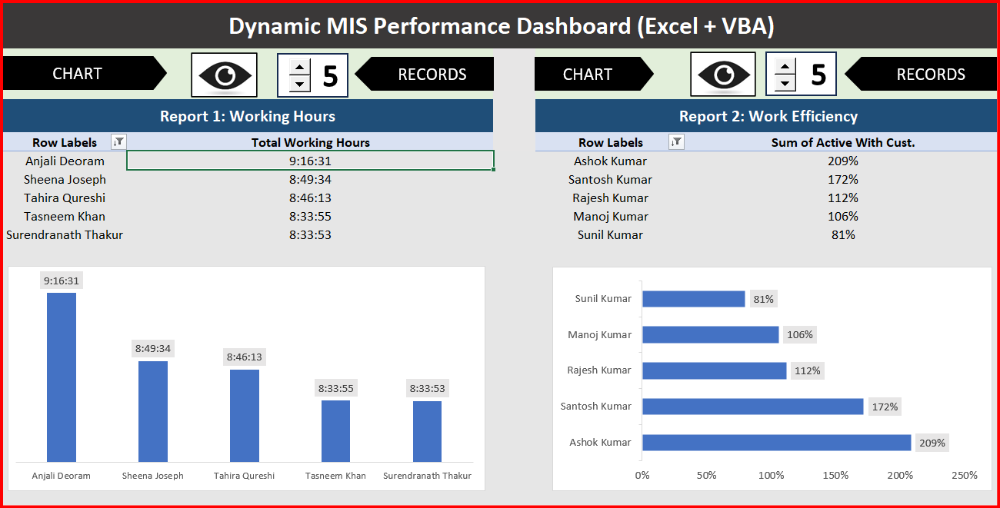
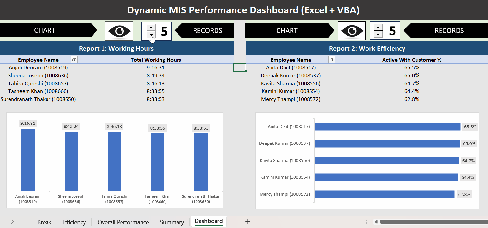

# Dynamic MIS Performance Dashboard (Excel + VBA)

An interactive Excel dashboard that ranks call-centre agents by working hours and by time active with customers.
Spinner controls choose how many top records to show, and VBA macros apply the filters and toggle the charts.

### Interactive demo

## What it tracks
- **Report 1:** Top N employees by total working hours
- **Report 2:** Top N employees by Active With Customer %

## How it works
- `Break`, `Efficiency`, `Overall Performance`: source sheets with break, efficiency and performance data for 149 employees
- `Summary`: one row per employee, pulling metrics with VLOOKUP and TIMEVALUE over named ranges (`B_Data`, `E_data`, `P_Data`)
- `Dashboard`: two pivot tables with pivot charts, and form-control spinners linked to cells `C2` and `C3`
- VBA macros read the spinner value and apply a Top N filter to each pivot; the eye buttons show or hide each chart

## Features
- Choose how many records to show (1 to 1000) with a spinner
- Show or hide each chart with one click
- Employees identified by name and ID, so people who share a name are not merged
- Working hours shown in `[h]:mm:ss` format

## Review notes: issues found and fixed
I rebuilt this from a tutorial and then reviewed the numbers, which exposed these issues:
- **Same-name employees were merged.** For example, four employees named Ashok Kumar were added together and showed 209% efficiency. Employees are now identified by name plus ID.
- **Working hours wrapped after 24 hours.** A summed 32:48:15 appeared as 08:48:15. The hours format is now `[h]:mm:ss`.
- **Spinner macros pointed to the wrong cells** after a title row was added, so the Top N filter failed. They now read the correct cells.
- **A broken link to an external workbook** was removed.
- **Two `#VALUE!` errors** in the Summary sheet (employees with a zero or blank efficiency value) are now handled with `IFERROR`.

## Key results (149 employees)
- Highest working hours: Anjali Deoram (1008519), 9:16:31
- Highest Active With Customer %: Anita Dixit (1008517), Deepak Kumar (1008537) and Kavita Sharma (1008556), about 65%

## Technical note
Excel does not offer Sum for time-formatted fields in a new pivot value, so Report 1 uses Max.
This is correct here because each employee appears exactly once.

## Files
| File | Description |
|---|---|
| `MIS_Performance_Dashboard.xlsm` | The dashboard workbook |
| `SpinnerCodeFiles.bas` | The VBA module |
| `dashboard.png`, `demo.gif` | Screenshot and demo |

## How to use
1. Download the `.xlsm` file and click **Enable Content** when Excel asks to enable macros
2. Open the **Dashboard** sheet
3. Change the spinner values to set how many records each report shows
4. Click the eye buttons to show or hide a chart

If macros are blocked on a downloaded file: right-click the file, choose Properties, tick Unblock, then reopen it.

## Credits and sample data
The base dashboard was learned from Satish Dhawale's YouTube tutorial on building MIS reports in Excel,
and the call-centre sample data comes from that tutorial. It is used here for practice only.
I then reviewed the dashboard, found the issues listed above, and fixed them.

## Author
Nidhi Gupta | [LinkedIn](https://www.linkedin.com/in/nidhigupta1997) | [GitHub](https://github.com/nidhigupta868714-ai)
